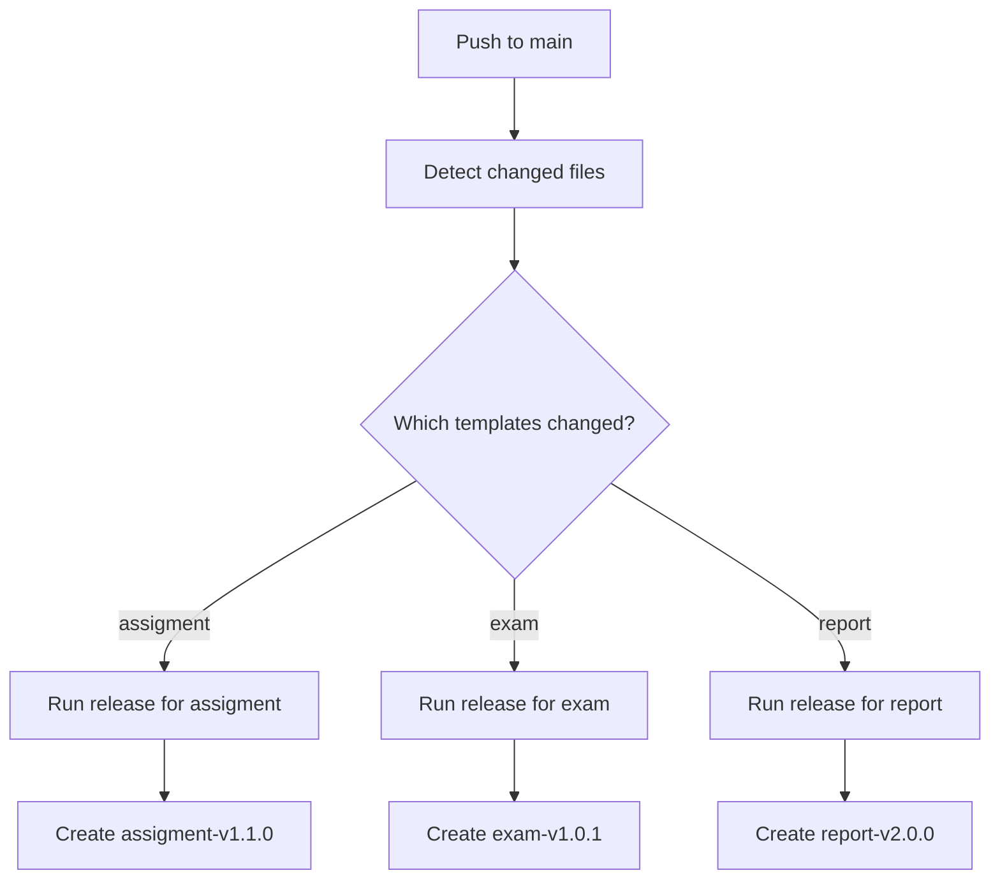

# Multi-Template Semantic Release - Setup Summary

This repository now supports **independent versioning for multiple Quarto templates** using semantic-release in a monorepo structure.

## 🎯 What Changed

### ✅ New Structure

Each template is now independently versioned:
- `assigment-v1.0.0`, `exam-v1.0.0`, etc.
- Each has its own `CHANGELOG.md` in its folder
- Each has its own `.releaserc.<template>.yml` config

### 📦 Key Files

| File | Purpose |
|------|---------|
| `.releaserc.assigment.yml` | Release config for assigment template |
| `.releaserc.template.yml` | Template file to copy for new templates |
| `.github/workflows/semantic-release.yml` | Detects changes and releases each template |
| `scripts/sync-template-version.mjs` | Generic script that works for any template |
| `assigment/CHANGELOG.md` | Changelog specific to assigment template |

### 🔄 How It Works Now

1. **Push to main** with commits like `feat(assigment): new feature`
2. **Workflow detects** which templates have changes
3. **Runs semantic-release** for each changed template independently
4. **Creates releases** with tags like `assigment-v1.1.0`

## 🚀 Adding a New Template

To add a new template (e.g., `exam`):

```bash
# 1. Copy the template config
cp .releaserc.template.yml .releaserc.exam.yml

# 2. Replace TEMPLATE_NAME with exam in the new file
sed -i '' 's/TEMPLATE_NAME/exam/g' .releaserc.exam.yml

# 3. Create changelog
mkdir -p exam
echo "# Changelog - Exam Template" > exam/CHANGELOG.md

# 4. Create your template structure
mkdir -p exam/_extensions/exam

# 5. Commit with the new scope
git add .
git commit -m "feat(exam): initial template"
git push origin main
```

The workflow will automatically detect and release it!

## 📝 Commit Examples

### Single Template
```bash
git commit -m "feat(assigment): add new rubric format"
git commit -m "fix(assigment): correct header spacing"
```

### Multiple Templates in One PR
```bash
git commit -m "feat(assigment): add group activities support"
git commit -m "fix(exam): correct footer alignment"
git push origin main
```

This creates two independent releases:
- `assigment-v1.1.0`
- `exam-v1.0.1`

## 🧪 Testing Locally

Test the version sync for any template:
```bash
node scripts/sync-template-version.mjs assigment 1.2.3
node scripts/sync-template-version.mjs exam 2.0.0
git checkout -- .  # Restore
```

## 📚 Documentation

- [CONTRIBUTING.md](CONTRIBUTING.md) - Full commit guidelines and workflow
- [SEMANTIC_RELEASE.md](SEMANTIC_RELEASE.md) - Technical details and troubleshooting

## 🏷️ Git Tags

Each template gets its own git tags:
- `assigment-v1.0.0`, `assigment-v1.1.0`, `assigment-v2.0.0`
- `exam-v1.0.0`, `exam-v1.1.0`
- `report-v1.0.0`

This allows independent versioning and rollback per template.

## 🔍 Workflow Logic



Each template is released independently based on its commits!
