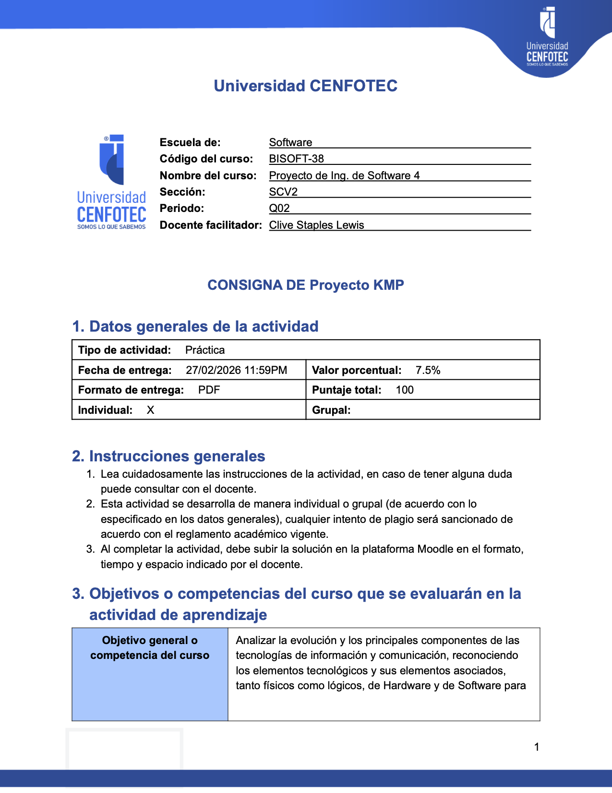
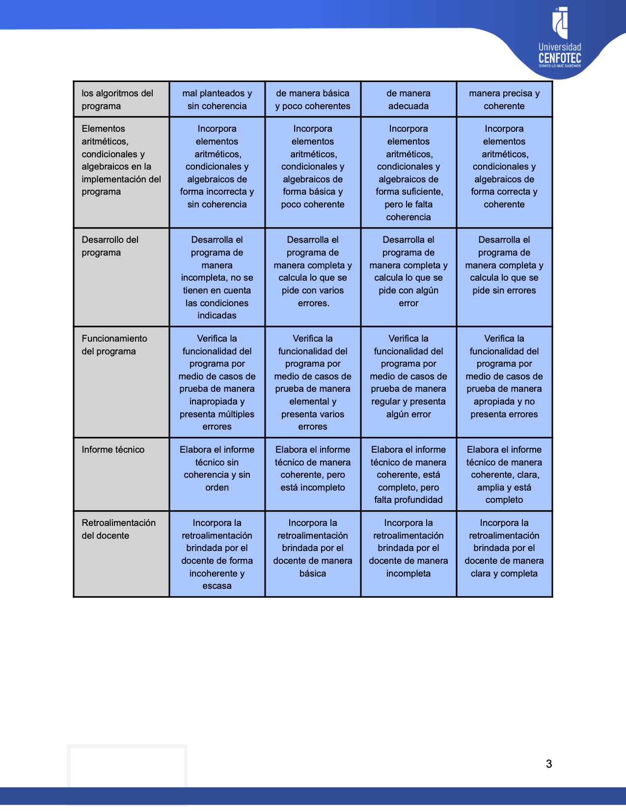

# Plantilla de Consignas - Universidad CENFOTEC

Plantilla Quarto para crear consignas de actividades académicas con formato profesional en PDF.

## 📦 Instalación

```bash
quarto use template kevinah95/cenfotec-quarto-templates/assigment
```

Este comando instalará la extensión y creará un archivo `.qmd` de ejemplo que puedes usar como punto de partida.

## ✨ Características

- ✅ Header, footer y logo embebidos (no configurables)
- ✅ Formato profesional de Universidad CENFOTEC
- ✅ Tablas prediseñadas para objetivos y rúbricas
- ✅ Personalización completa desde YAML

## 🚀 Uso Rápido

Crea un archivo `.qmd` con la siguiente estructura:

```yaml
---
# Información del curso
school: "Software"
course-code: "BISOFT-38"
course-name: "Proyecto de Ing. de Software 4"
tsection: "SCV2"
period: "Q02"
instructor: "Clive Staples Lewis"

# Datos generales de la actividad
activity-title: "Proyecto KMP"
activity-type: "Práctica"
due-date: "27/02/2026 11:59PM"
percentage: "7.5%"
tformat: "PDF"
total-points: "100"
individual: true
group: false

# Instrucciones generales (opcional)
general-instructions:
  - "Lea cuidadosamente las instrucciones de la actividad."
  - "Cualquier intento de plagio será sancionado."
  - "Suba la solución en Moodle en el formato indicado."

# Objetivos
general-objective: "Objetivo general del curso..."
specific-objectives: |
  - Primer objetivo específico
  - Segundo objetivo específico

# Descripción de la actividad
activity-context: "Descripción del contexto de la actividad..."
activity-instructions:
  - "Primera instrucción"
  - "Segunda instrucción"

# Rúbrica
rubric-criteria:
  - criteria: "Criterio 1"
    deficient: "Descripción nivel deficiente"
    regular: "Descripción nivel regular"
    good: "Descripción nivel bueno"
    excellent: "Descripción nivel excelente"

format:
  assigment-typst:
    keep-typ: true
---
```

Luego renderiza el documento:

```bash
quarto render tu-archivo.qmd
```

## 📋 Parámetros Principales

| Parámetro | Descripción | Requerido |
|-----------|-------------|-----------|
| `school` | Escuela (Software, TI, etc.) | ✅ |
| `course-code` | Código del curso | ✅ |
| `course-name` | Nombre del curso | ✅ |
| `activity-title` | Título de la actividad | ✅ |
| `activity-type` | Tipo (Práctica, Taller, etc.) | ✅ |
| `due-date` | Fecha de entrega | ✅ |
| `percentage` | Valor porcentual | ✅ |
| `individual` / `group` | Modalidad | ✅ |
| `general-instructions` | Lista de instrucciones | ⚠️ Opcional |
| `rubric-criteria` | Criterios de evaluación | ⚠️ Opcional |

## 📸 Resultado

El documento generado incluye:


*Página 1: Información del curso y datos generales*


*Página 2: Objetivos y descripción de la actividad*


*Página 3: Rúbrica de evaluación*
